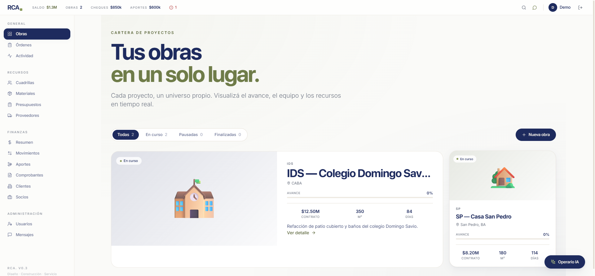
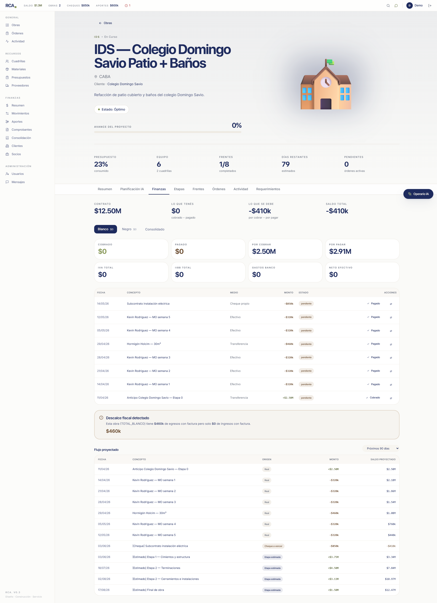
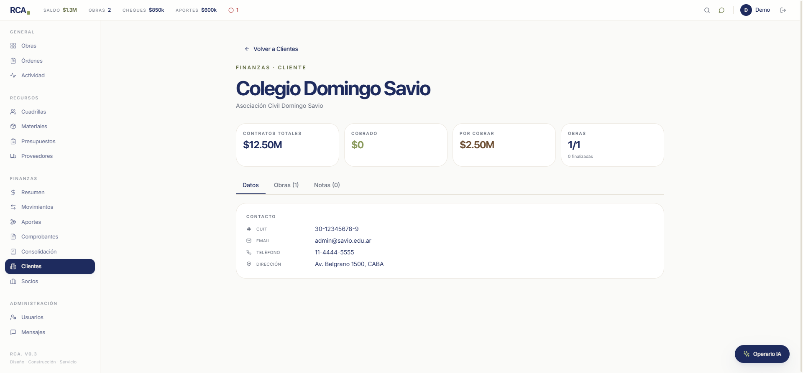
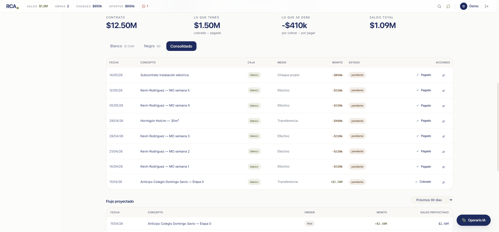
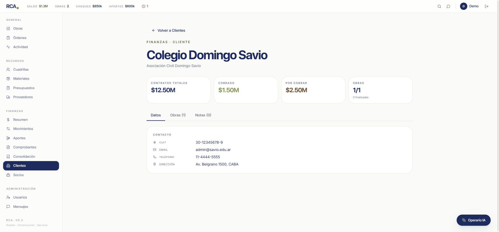
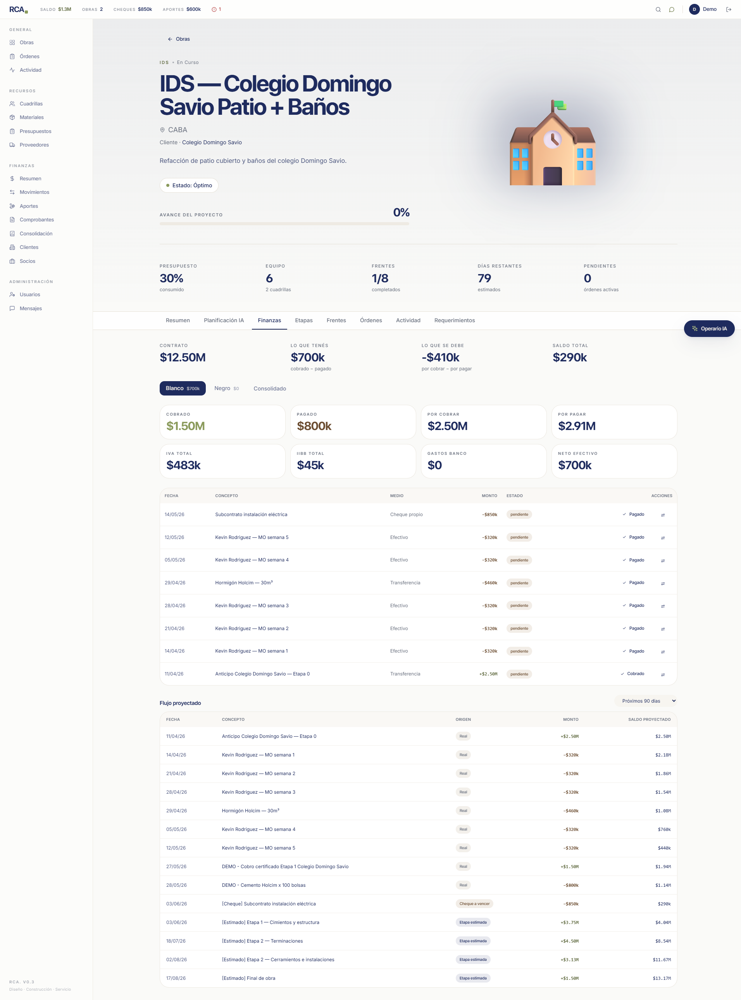
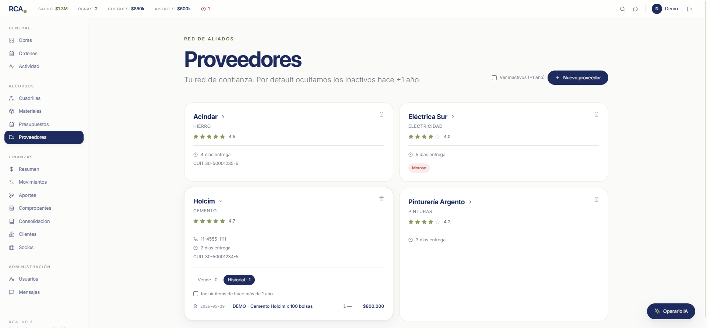
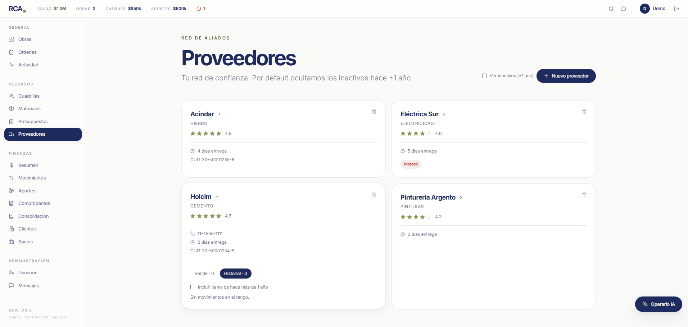
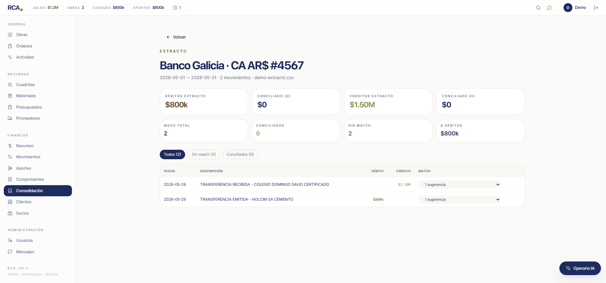
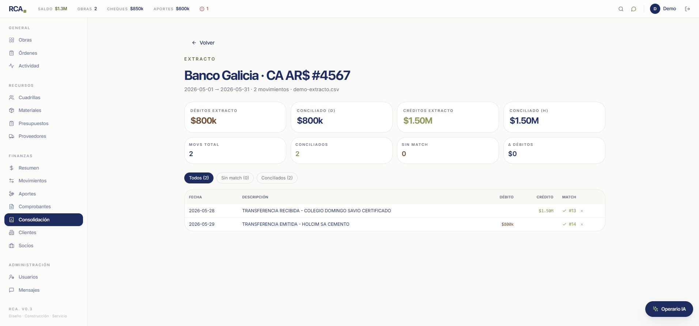

# Demo — Flujo de caja conectado de punta a punta

> Fecha: 2026-05-31 · Rama: `sprint-23-consolidacion-bancaria` · Usuario: modo demo

## Objetivo

Mostrar que **un solo movimiento financiero en RCA se propaga automáticamente a todas las vistas conectadas**: el panel de la obra, la caja blanco/negro, el dashboard del cliente, el historial del proveedor y la consolidación bancaria.

La pregunta que respondemos es: *"si registro un cobro a un cliente, ¿se ve reflejado en la obra, en el cliente, en el saldo total y en la consolidación con el extracto del banco?"*. Respuesta: **sí**, porque todo se enlaza a través de una única tabla central — `MovimientoObra`.

## Modelo conectado

```
                    MovimientoObra (tabla central)
              ┌───────────────────┴────────────────────┐
              │ obra_id           → /obra/:id          │
              │ cliente (via obra.cliente)             │
              │ proveedor_id (opcional)                │
              │ etapa_id (opcional)                    │
              │ comprobante_id (opcional, factura)     │
              │ legalidad (blanco | negro)             │
              │ cobro_pago_estado (pendiente|cobrado|  │
              │                     pagado)            │
              │ iva_pct, iibb_pct, gastos_banco        │
              └────────────────────────────────────────┘
                              ↓ propaga a
   ┌──────────────┬──────────────┬───────────────┬──────────────────┐
   ▼              ▼              ▼               ▼                  ▼
Obra/Finanzas  Cliente       Proveedor      Movimientos       Consolidación
(BigStats,    (Cobrado,      (Historial    (tabla global,    (match contra
 caja B/N,    Por cobrar,     pago_directo) filtros)          extracto del
 IVA/IIBB,    obras)                                            banco)
 saldo)
```

## Sprints involucrados

- **S21** Contabilidad blanco/negro por obra: agrega `legalidad`, `cobro_pago_estado`, `iva_pct`, `iibb_pct`, `gastos_banco` a `MovimientoObra` + endpoint de resumen blanco/negro.
- **S22** Memoria de clientes: dashboard `/clientes/:id` con resumen financiero agregado de las obras del cliente.
- **S23** Consolidación bancaria: tablas `Extracto` y `MovimientoBancario` + match contra `MovimientoObra` + endpoint de diferencias.
- **S15** Proveedores extendido: historial del proveedor con tipos `facturado` / `presupuestado` / **`pago_directo`** (este último agregado durante la demo).

## Estado inicial (baseline)

Login con el botón **"Probar en modo demo"** del `/login`.

### Banner global (estado 0)
```
SALDO $1.3M · OBRAS 2 · CHEQUES $850k · APORTES $600k
```


### Obra IDS → tab Finanzas (estado 0)
- Contrato: **$12.50M**
- Lo que tenés: **$0** (cobrado − pagado)
- Lo que se debe: **-$410k** (por cobrar − por pagar)
- Saldo total: **-$410k**
- Caja Blanco: Cobrado $0 · Pagado $0 · Por cobrar $2.50M · Por pagar $2.91M
- Caja Negro: $0
- Todos los movimientos seedeados están en estado `pendiente`.



### Cliente Colegio Domingo Savio (estado 0)
- Contratos totales: $12.50M
- **Cobrado: $0**
- Por cobrar: $2.50M
- Obras: 1/1 (0 finalizadas)



---

## Acción 1 — INGRESO blanco cobrado $1.500.000

**Lo que cargamos:** un cobro real de la obra IDS al cliente Colegio Domingo Savio, en blanco (con factura A), por transferencia bancaria, IVA 21%, IIBB 3%.

```http
POST /api/comprobantes              # crea factura A 0001-00000999 por $1.500.000
POST /api/movimientos {
  obra_id: 1,
  tipo: "INGRESO",
  origen_ingreso: "CERTIFICADO_ETAPA",
  monto: 1500000,
  medio_pago: "TRANSFERENCIA",
  legalidad: "blanco",
  cobro_pago_estado: "cobrado",
  fecha_cobro_pago: "2026-05-28",
  iva_pct: 0.21, iibb_pct: 0.03,
  comprobante_id: 2
}
→ MovimientoObra id=13
```

### Propagación instantánea

| Vista | Campo | Antes | Después | Delta |
|---|---|---|---|---|
| `/obra/1` Finanzas | Lo que tenés | $0 | **$1.50M** | +$1.5M |
| `/obra/1` Finanzas | Saldo total | -$410k | **$1.09M** | +$1.5M |
| `/obra/1` Finanzas | Caja Blanco Cobrado | $0 | **$1.50M** | +$1.5M |
| `/clientes/1` | Cobrado | $0 | **$1.50M** | +$1.5M |




**Lo importante:** un solo POST modifica 4 BigStats en 2 páginas distintas sin código de "actualización" en el frontend — cada página recalcula desde la tabla central al cargar.

---

## Acción 2 — EGRESO blanco pagado $800.000 a Holcim

**Lo que cargamos:** un pago de la obra IDS al proveedor Holcim, en blanco (factura recibida A), por transferencia, IVA 21%.

```http
POST /api/comprobantes              # FC_A recibida 0012-00045678 de Holcim
POST /api/movimientos {
  obra_id: 1,
  tipo: "EGRESO",
  categoria_egreso: "MATERIALES",
  monto: 800000,
  medio_pago: "TRANSFERENCIA",
  legalidad: "blanco",
  cobro_pago_estado: "pagado",
  fecha_cobro_pago: "2026-05-29",
  iva_pct: 0.21,
  comprobante_id: 3,
  proveedor_id: 1                    # ← Holcim
}
→ MovimientoObra id=14
```

### Propagación instantánea

| Vista | Campo | Antes | Después | Delta |
|---|---|---|---|---|
| `/obra/1` Finanzas | Caja Blanco Pagado | $0 | **$800k** | +$800k |
| `/obra/1` Finanzas | Lo que tenés | $1.50M | **$700k** | −$800k |
| `/obra/1` Finanzas | Saldo total | $1.09M | **$290k** | −$800k |
| `/obra/1` Finanzas | IVA total | $0 | **$483k** | +$483k |
| `/obra/1` Finanzas | IIBB total | $0 | **$45k** | +$45k |
| `/obra/1` header | Presupuesto consumido | 23% | **30%** | +7pp |
| `/proveedores/1` Historial | items | 0 | **1 ($800.000)** | +1 |




**Lo importante:** el mismo movimiento toca 7 valores en 3 vistas distintas. El IVA y el IIBB se calculan en el resumen sin que tengamos que persistirlos por separado.

---

## ⚠️ Bug encontrado durante la demo (y arreglado en vivo)

Cuando abrí `/proveedores/1` (Holcim) después de cargar el EGRESO, el tab **Historial** decía `Sin movimientos en el rango`. El pago de $800k **no aparecía**.



### Diagnóstico
El endpoint `GET /api/proveedores/:id/historial` solo combinaba:
1. `RetiroMaterial` con `proveedor_id = X` → tipo `facturado`.
2. `PresupuestoItem` cuyo `material.proveedor_id = X` → tipo `presupuestado`.

**No miraba `MovimientoObra` con `proveedor_id = X`** — es decir, los pagos directos cargados como movimiento (sin pasar por el flujo de retiros del Sprint 14) eran invisibles desde el dossier del proveedor.

### Fix aplicado
[backend/app/routers/proveedores.py:208](../../backend/app/routers/proveedores.py#L208) suma una tercera query:

```python
# Pago directo: MovimientoObra tipo=EGRESO con proveedor_id=pid
q3 = db.query(models.MovimientoObra).filter(
    models.MovimientoObra.proveedor_id == pid,
    models.MovimientoObra.tipo == models.TipoMovimiento.EGRESO,
)
for mo in q3.all():
    items.append(schemas.ProveedorHistorialItem(
        fecha=mo.fecha,
        tipo="pago_directo",
        material_nombre=mo.concepto,
        subtotal=float(mo.monto),
        en_negro=mo.legalidad == LegalidadMovimiento.negro,
        forma_pago=mo.medio_pago,
        obra_destino_nombre=obra.codigo,
        ref_id=mo.id,
    ))
```

Después del fix, recargué `/proveedores/1` → tab Historial pasó de `0` a `1` con la línea del pago de $800k.

**Por qué importa:** sin este fix, Tomi pagaría a un proveedor y el dossier del proveedor no se enteraría. El dashboard del cliente y la obra estaban OK; el proveedor era el eslabón que faltaba.

---

## Acción 3 — Consolidación bancaria: subir extracto y matchear

Simulamos el descargo del extracto del Banco Galicia (CA AR$ #4567) con las **mismas 2 operaciones**:

```csv
Fecha,Concepto,Debito,Credito,Saldo
2026-05-28,TRANSFERENCIA RECIBIDA - COLEGIO DOMINGO SAVIO CERTIFICADO,0,1500000,1500000
2026-05-29,TRANSFERENCIA EMITIDA - HOLCIM SA CEMENTO,800000,0,700000
```

Subido por `POST /api/extractos` → `Extracto id=1` con 2 `MovimientoBancario`.

### Antes de matchear

| Métrica | Valor |
|---|---|
| Débitos extracto | $800k |
| Conciliado (D) | $0 |
| Créditos extracto | $1.50M |
| Conciliado (H) | $0 |
| Conciliados / Total | **0 / 2** |
| Δ Débitos | **$800k** |
| Δ Créditos | **$1.50M** |

Cada movimiento bancario muestra "1 sugerencia" en el dropdown — el endpoint `GET /api/extractos/:id/sugerencias` encontró el `MovimientoObra` correspondiente filtrando por:
- `monto` exacto (`$1.500.000` y `$800.000`)
- `tipo` (`débito → EGRESO`, `crédito → INGRESO`)
- ventana de ±7 días contra `MovimientoObra.fecha`
- excluyendo los `MovimientoObra` ya matcheados en otro `MovimientoBancario`



### Match

```http
POST /api/movimientos-bancarios/1/match { movimiento_obra_id: 13 }
POST /api/movimientos-bancarios/2/match { movimiento_obra_id: 14 }
```

### Después de matchear

| Métrica | Valor |
|---|---|
| Débitos extracto | $800k |
| Conciliado (D) | **$800k** |
| Créditos extracto | $1.50M |
| Conciliado (H) | **$1.50M** |
| Conciliados / Total | **2 / 2** |
| **Δ Débitos** | **$0** |
| **Δ Créditos** | **$0** |



**Lo importante:** la diferencia entre "lo que dice el banco" y "lo que dice mi obra" es **cero**. Eso significa que la contabilidad interna refleja la realidad del extracto. Si al cierre del mes hay diferencia ≠ 0, hay algo cargado en la plataforma que no figura en el banco (o viceversa) y aparece como **alerta**.

---

## Tabla resumen end-to-end

|  | Obra IDS | Cliente Domingo Savio | Proveedor Holcim | Consolidación Galicia |
|---|---|---|---|---|
| **Estado 0** | tenés $0, saldo −$410k | cobrado $0 | historial vacío | sin extracto |
| **Después INGRESO $1.5M** | tenés $1.5M, saldo $1.09M, Blanco Cobrado $1.5M | **cobrado $1.5M** | — | — |
| **Después EGRESO $800k** | tenés $700k, saldo $290k, Blanco Pagado $800k, IVA $483k, IIBB $45k, Presupuesto 30% | cobrado $1.5M | **historial 1 ítem $800k** *(post-fix)* | — |
| **Después conciliación** | sin cambio | sin cambio | sin cambio | **Δ=$0, 2/2 conciliados** |

---

## Conclusiones

1. **Todo se enlaza a través de `MovimientoObra`.** Ese es el único punto donde se persiste un movimiento real de dinero. El resto (resumen blanco/negro, dashboard cliente, historial proveedor, consolidación) son **vistas calculadas** sobre esa misma tabla.

2. **No hay duplicación de datos.** Cuando Tomi marca un movimiento como "cobrado", todas las vistas se enteran automáticamente al recargar — no hay sincronización manual, no hay riesgo de que dos pantallas muestren números distintos.

3. **El historial del proveedor estaba incompleto**, lo descubrimos con la demo. El fix es chico (~25 líneas) pero indispensable: sin esto, los pagos cargados como `MovimientoObra` con `proveedor_id` no aparecían en el dossier del proveedor.

4. **La consolidación cierra el ciclo.** Tener el extracto bancario importado y matcheado contra los movimientos es la única forma confiable de detectar movimientos olvidados, duplicados o mal cargados. Mientras la `Δ` no sea $0, hay trabajo pendiente de conciliar.

## Cómo reproducir la demo

1. Levantar backend (`uvicorn app.main:app --port 8010`) y frontend (`npm run dev` en `frontend/`).
2. `http://localhost:5173/login` → **Probar en modo demo**.
3. Obtener un token: `curl -X POST http://127.0.0.1:8010/api/auth/demo-login`.
4. Ejecutar los `POST` de los pasos 1, 2 y 3 con `Authorization: Bearer <token>`.
5. Refrescar `/obra/1`, `/clientes/1`, `/proveedores` (expandir Holcim) y `/consolidacion/:id` después de cada paso para ver la propagación.

Los datos quedan en `is_demo=True` — no contaminan la base real cuando se conecte a Tomi en producción.
